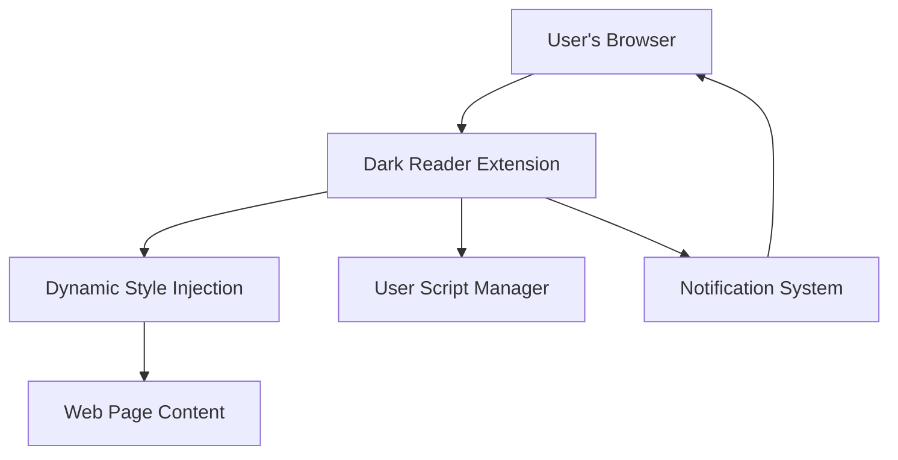

## What is Dark Reader?

Dark Reader is a browser extension designed to transform the browsing experience by enabling dark mode on virtually any website. It helps users achieve improved readability and significantly reduces eye strain caused by bright, glaring backgrounds—especially useful during night-time browsing or extended screen time. Beyond simply applying a dark theme, Dark Reader standardizes how dark styles appear across diverse web pages, creating a consistent and comfortable visual environment.

## Defining Dark Reader and Its Audience

At its core, Dark Reader dynamically injects custom stylesheets into web pages to convert their light backgrounds and text colors into harmonious dark tones. This process happens seamlessly and in real-time as you navigate the web, requiring no manual changes on individual sites.

Dark Reader is made for anyone who spends considerable time online and desires a less fatiguing browsing experience. This includes late-night researchers, professionals working long hours on web applications, and users sensitive to bright screens. It also appeals to users who want a uniform dark mode experience across sites that otherwise lack native support.

## How Dark Reader Works Behind the Scenes

Dark Reader operates by analyzing the styles of a loaded webpage and then applying a dynamic filter that adapts colors into dark mode alternatives. This approach allows it to work universally without relying on websites offering native dark themes.

The extension manages three main components to deliver its functionality:

- **Dynamic Style Injection:** It overrides page styles on the fly, transforming colors into dark equivalents.
- **User Script Management:** Advanced users can inject custom scripts to tailor site-specific behavior.
- **Notification Handling:** It manages user alerts related to updates, permissions, or configuration feedback.



This flow illustrates the extension's role as a mediator that intercepts page rendering, applies dark styles dynamically, and lets users customize or receive feedback.

## Dark Reader in Action: Bringing Comfort to Browsing

Imagine a graphic designer working late into the night. Without Dark Reader, they face harsh white backgrounds that tire their eyes quickly. With Dark Reader enabled, every visited page—from documentation sites to social media—adopts a gentle dark theme. Text remains crisp and legible while blues and greys tone down to comfortable hues, allowing longer work sessions without discomfort.

Users can toggle Dark Reader on or off per site or customize brightness, contrast, and sepia levels for personalized comfort. For example, on a news site, a user might want higher contrast for better clarity, while on a photo gallery page, subtler adjustments preserve image quality.

```javascript
// Example: Turning Dark Reader on via the extension UI
chrome.runtime.sendMessage({ toggleDarkMode: true });
```

Because Dark Reader manipulates styles dynamically, it adapts smoothly when navigating between sites or refreshing pages without requiring additional input from users.

## Getting Started Preview and Where to Go Next

Activating Dark Reader is straightforward, with no prerequisite setup beyond installing the extension for your preferred browser. Users can immediately benefit from a dark mode experience tailored to their comfort.

To dive into hands-on setup, visit the [Installation Guide](/getting-started/quick-setup/installation-guide), then explore [Activating and Toggling Dark Mode](/guides/core-workflows/activating-dark-mode) to master on-demand use. For deeper customization, the [Injecting Custom User Scripts](/guides/advanced-use-cases/injecting-custom-scripts) page offers expert workflows.

Explore more about Dark Reader's design and underlying principles in the [System Architecture Overview](/overview/introduction-architecture/system-architecture). 

<Source url="https://github.com/darkreader/darkreader" branch="main" paths={[{"path": "src/background/index.ts", "range": "10-75"}]} />