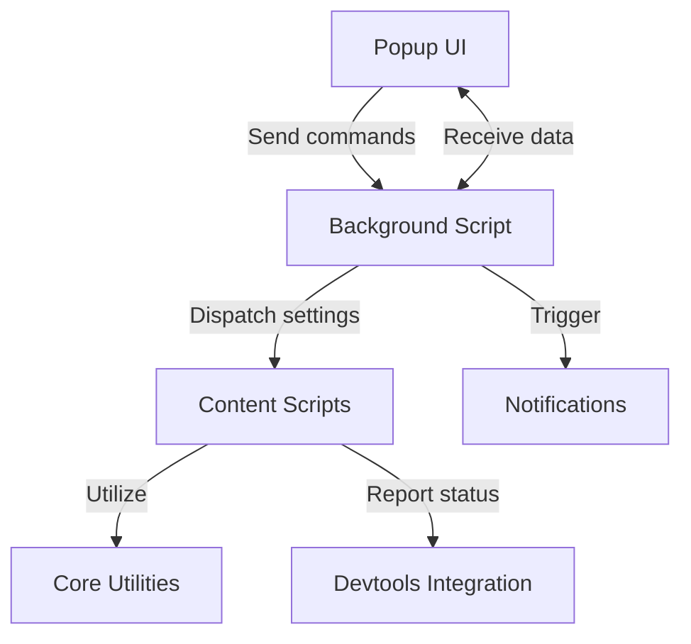

## Navigating Dark Reader's System Architecture

Understanding how Dark Reader's core components work together is essential for both users aiming to grasp its capabilities and developers exploring its internals. This overview unpacks the primary modules within the extension and their interactions, clarifying how Dark Reader delivers a seamless dark mode experience across websites. By mapping the flow between background processes, content scripts, user interface elements, and development tools, users gain insight into the extension’s reliable and responsive operation.

## Defining the Components and Their Roles

Dark Reader is structured around several key modules that collaborate to modify web pages effectively while maintaining performance and user control. These components include:

- **Background Scripts:** Serve as the central orchestrators, managing persistent states, preferences, and communication across tabs.
- **Content Scripts:** Injected dynamically into web pages to apply dark mode styles and adjustments directly within the user's browsing context.
- **Core Utilities:** Encapsulate the main logic for theme calculations, filtering, and style generation, providing reusable functionality for other modules.
- **Notifications:** Facilitate communication to the user, delivering alerts or feedback related to theme changes and extension status.
- **Popup UI:** The user-facing panel accessed via the browser toolbar, allowing configuration, toggling dark mode, and adjusting site-specific settings.
- **Devtools Integration:** Offers advanced users and developers inspection and debugging tools related to the extension’s behavior on particular pages.

This modular architecture targets users ranging from everyday consumers who want effortless night viewing to contributors seeking to extend or troubleshoot Dark Reader’s functionality.

## Core Architecture Flow

At a high level, Dark Reader operates through coordinated messaging and state management between its modules. When a user activates the extension on a website, the popup UI sends commands to the background script. The background script maintains the user’s settings and propagates instructions to content scripts loaded in tabs, triggering them to apply dark theme transformations using core utilities.

Notifications surface any significant events or errors back to the user, ensuring transparency. Developers can leverage the devtools integration to observe the styling process in real-time and diagnose issues.



This interaction model guarantees that user preferences remain synchronized across browsing sessions and tabs, with a clean separation between interface, logic, and page-level changes.

## Architecture in Action

Imagine visiting a news website on a bright screen at night. Upon enabling Dark Reader via the popup, the following happens:

The popup UI forwards your request to toggle dark mode to the background script. The background module checks your saved preferences and broadcasts the activation to all relevant content scripts running in open tabs. Each content script then calls on the core utilities to compute the appropriate color transformations and applies these styles directly to the page's DOM. Meanwhile, if the extension encounters an unsupported element or a conflicting style, it sends a notification to inform you via the browser’s alerts.

Developers inspecting the page can open devtools panels customized by Dark Reader to see the applied CSS filters and any dynamic style adjustments, facilitating deeper understanding or debugging.

```javascript
// Example: Popup triggering background to enable dark mode
browser.runtime.sendMessage({ action: 'toggle-dark-mode', enabled: true });
```

By separating concerns this way, Dark Reader optimizes performance and ensures users have granular control over their experience across multiple websites and sessions.

## Starting Your Exploration

To get hands-on with Dark Reader’s internals, expect to first install and configure the extension via the standard setup described in the [Installation Guide](/getting-started/quick-setup/installation-guide). Next, the background script acts as the hub—familiarizing yourself with its messaging patterns will demystify how various parts coordinate.

For a deeper dive, consult the [Core Concepts & Terminology](/overview/key-concepts-users/core-concepts-glossary) to understand the foundational terms appearing across components. When ready, explore the [Activating and Toggling Dark Mode](/guides/core-workflows/activating-dark-mode) guide for practical workflows reflecting the architectural flow described here.

<Source url="https://github.com/darkreader/darkreader" branch="main" paths={[{"path": "src/background/index.js", "range": "1-100"},{"path": "src/content/index.js", "range": "1-100"}]} />