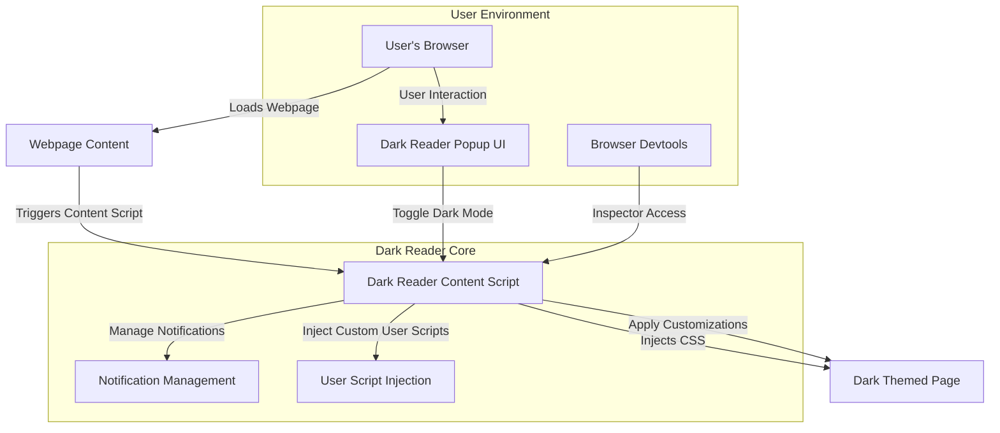

## Discover Dark Reader's Core Features and Use Cases

Dark Reader empowers users to transform their web browsing experience by applying dark themes seamlessly across websites. Its intuitive feature set not only enhances readability and reduces eye strain but also delivers extensive control over appearance and behavior. Whether toggling dark mode on the fly, customizing site-specific styling, injecting user scripts, or leveraging developer tools for troubleshooting, Dark Reader is designed to adapt dynamically to your needs.

## What Dark Reader Does and Who Benefits

At its heart, Dark Reader is a browser extension that applies dark color schemes to web pages by dynamically modifying their styles without altering the original content. It is crafted for everyday users who want a comfortable reading experience during night-time or long browsing sessions, web developers seeking powerful debugging capabilities, and power users who demand fine-grained customization and automation.

## How Dark Reader Works at a Glance

Dark Reader operates by intercepting page styles through its content scripts and injecting CSS modifications that invert colors intelligently, emphasizing contrast and color balance. It integrates deeply with the browser environment to monitor page loads, user interactions, and visibility changes, enabling responsive toggling and customization. The architecture supports notifications and user script injection as modular capabilities, enriching user control and developer flexibility.



## Features in Action: Real-World Scenarios

Imagine browsing a news website late at night: with one click, you activate Dark Reader, instantly transforming glaring whites into soothing dark hues without compromising layout or readability. You notice a few elements that look off, so you open the customization panel where you fine-tune brightness and contrast until the page feels just right for your eyes. Meanwhile, notifications from Dark Reader quietly inform you about extension updates or permission requests without disrupting your workflow.

For developers, Dark Reader offers direct integration with devtools, enabling the inspection of applied styles and troubleshooting of rendering issues caused by complex CSS interplay. Advanced users can inject custom scripts on specific sites to automate dark mode toggling or modify behaviors, unlocking powerful personalization beyond the standard feature set.

Here’s a simple snippet demonstrating how a user might toggle dark mode from the popup UI:

```javascript
// Access popup toggle button
const toggleButton = document.getElementById('dark-mode-toggle');
toggleButton.addEventListener('click', () => {
  // Send message to content script to toggle dark mode
  chrome.tabs.query({active: true, currentWindow: true}, tabs => {
    chrome.tabs.sendMessage(tabs[0].id, { action: 'toggleDarkMode' });
  });
});
```

This small interaction bridges UI and content injection, encapsulating the extension’s ease of use.

## Getting Started with Dark Reader

Before diving into customization or advanced script injection, you’ll want to complete the installation and basic setup, which ensures your browser environment supports Dark Reader’s features effectively. After that, you can explore toggling dark mode easily or begin customizing individual sites through the user interface.

Explore the [Getting Started Guide](/getting-started/quick-setup/installation-guide) for detailed configuration steps, or head straight to [Activating and Toggling Dark Mode](/guides/core-workflows/activating-dark-mode) to understand the core user interactions. For more specialized workflows, the sections on [Customizing Site Appearance](/guides/core-workflows/customizing-sites) and [Injecting Custom User Scripts](/guides/advanced-use-cases/injecting-custom-scripts) provide deeper guidance.

<Source url="https://github.com/darkreader/darkreader" branch="main" paths={[{"path": "src/content_scripts/index.ts", "range": "10-80"},{"path": "src/ui/popup/index.tsx", "range": "5-50"}]} />
